# CMOS Circuit Design and SPICE Simulations using Sky130

A comprehensive documentation of CMOS circuit design concepts and SPICE simulations using the open-source SkyWater 130nm (Sky130) Process Design Kit (PDK). This repository covers 5 days of structured learning — from MOSFET fundamentals to robustness analysis of CMOS inverters.

---

## Table of Contents

- [About the Workshop](#about-the-workshop)
- [Tools Used](#tools-used)
- [Day 1 – NMOS Basics and Drain Current Characteristics](#day-1--nmos-basics-and-drain-current-characteristics)
- [Day 2 – Velocity Saturation and CMOS Inverter VTC](#day-2--velocity-saturation-and-cmos-inverter-vtc)
- [Day 3 – CMOS Switching Threshold and Dynamic Simulations](#day-3--cmos-switching-threshold-and-dynamic-simulations)
- [Day 4 – CMOS Noise Margin Robustness](#day-4--cmos-noise-margin-robustness)
- [Day 5 – Power Supply and Device Variation Robustness](#day-5--power-supply-and-device-variation-robustness)
- [Key Takeaways](#key-takeaways)

---

## About the Workshop

This workshop covers the fundamentals of CMOS circuit design and SPICE simulations using the Sky130 PDK — an open-source 130nm process technology developed by SkyWater Technology Foundry in collaboration with Google. The course builds understanding from individual MOSFET behavior all the way up to full CMOS inverter characterization, including noise margins, transient delays, and robustness under process and supply voltage variations.

---

## Tools Used

- **ngspice** — Open-source SPICE simulator
- **Sky130 PDK** — SkyWater 130nm Process Design Kit
- **VirtualBox** — Virtual machine environment for running simulations
- **GitHub** — Version control and documentation

---

## Day 1 – NMOS Basics and Drain Current Characteristics

### Why Do We Need SPICE Simulations?

In CMOS design, complex digital circuits such as NAND, NOR, AND, and OR gates are all built from combinations of PMOS and NMOS transistors. Before fabricating a chip, engineers need to verify that the circuit will behave correctly, meet timing requirements, and operate within acceptable power limits.

This is where **SPICE (Simulation Program with Integrated Circuit Emphasis)** becomes essential. SPICE allows us to simulate the electrical behavior of circuits with great accuracy before any physical chip is manufactured. It helps us:

- Calculate propagation delays through logic gates
- Characterize transistor I-V curves
- Build **delay tables** used in Static Timing Analysis (STA)
- Optimize transistor W/L ratios for performance and power

Without SPICE simulation results, downstream physical design steps like clock tree synthesis, timing closure, and crosstalk analysis would have no reliable data to work with.

---

### Introduction to the NMOS Transistor

An NMOS (N-type Metal Oxide Semiconductor) transistor is built on a **P-type silicon substrate**. Its structure consists of:

- Two heavily doped **n+ regions** that form the **Source** and **Drain** terminals
- A thin **silicon dioxide (SiO₂) oxide layer** grown on top of the substrate between Source and Drain
- A **metal (or polysilicon) gate** deposited on top of the oxide, which controls current flow
- A **Body (Bulk/Substrate)** terminal connected to the P-type substrate

The gate is electrically isolated from the channel by the oxide layer. This means the gate draws virtually no DC current — it controls transistor operation purely through the electric field it creates, which is why these devices are called **field-effect transistors**.

---

### Threshold Voltage (Vt)

The **threshold voltage (Vt)** is one of the most fundamental parameters of a MOSFET. It defines the minimum gate-to-source voltage (Vgs) required to form a conducting channel between Source and Drain.

**Case 1: Vgs = 0V**
When no voltage is applied to the gate, the Source and Drain n+ regions are separated by the P-type substrate. No current flows and no channel exists.

**Case 2: Vgs > 0 (small positive voltage)**
As we increase Vgs, the positive charge on the gate repels holes in the P-substrate near the surface and attracts electrons. A **depletion region** begins to form just below the oxide.

**Case 3: Strong Inversion (Vgs = Vt)**
When Vgs reaches the threshold voltage, the surface concentration of electrons equals the bulk hole concentration. The surface is now effectively **N-type** — this is called **strong inversion**. A conductive channel now exists between Source and Drain.

> **Key point:** Even though a channel exists, if no drain voltage (Vds) is applied, electrons have no reason to move. This is the boundary of the **cut-off region**.

---

### Body Effect (Threshold Voltage with Substrate Bias)

When a negative voltage is applied to the body relative to the source (Vsb > 0 for NMOS), the depletion region widens. This means more gate voltage is needed to invert the surface and form a channel.

The result: **threshold voltage increases with increasing Vsb**. This phenomenon is called the **Body Effect** and is characterized by the body effect coefficient **γ (gamma)**.

---

### Regions of Operation

#### 1. Cut-off Region (Vgs < Vt)
No channel is formed. The transistor is OFF and drain current Id ≈ 0.

#### 2. Linear (Resistive) Region (Vgs > Vt, Vds < Vgs - Vt)
Device behaves like a **voltage-controlled resistor**.

```
Id = μn × Cox × (W/L) × [(Vgs - Vt)×Vds - Vds²/2]
```

#### 3. Saturation Region (Vgs > Vt, Vds ≥ Vgs - Vt)
Channel **pinches off** at the Drain end. Id becomes nearly constant.

```
Id = (μn × Cox / 2) × (W/L) × (Vgs - Vt)²
```

Including Channel Length Modulation (λ):

```
Id = (μn × Cox / 2) × (W/L) × (Vgs - Vt)² × (1 + λ×Vds)
```

---

### SPICE Netlist — Day 1 (Long Channel NMOS, L=2µm, W=5µm)

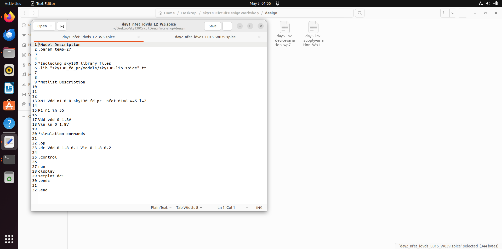

---

### Simulation Output — Id vs Vds

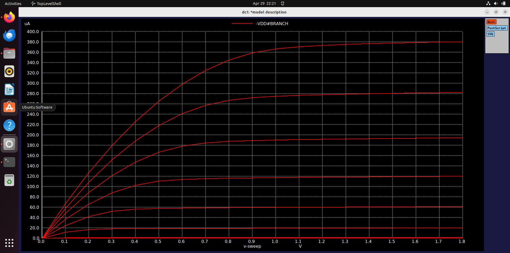

**Observations:**
- Bottom curve (Vgs = 0V) → transistor OFF, no current flows (**cut-off region**)
- Each curve above → Vgs increases in 0.6V steps
- Left steep portion → **Linear region** (Id rises with Vds)
- Right flat portion → **Saturation region** (Id nearly constant)
- Higher Vgs → stronger channel → more saturation current

---

## Day 2 – Velocity Saturation and CMOS Inverter VTC

### Velocity Saturation in Short Channel Devices

For **long channel devices** (L > ~1μm), Id follows a quadratic relationship with (Vgs - Vt). For **short channel devices** (L < ~0.5μm), the electric field becomes very high causing carrier velocity to saturate at **v_sat**.

| Region | Condition | Id behavior |
|--------|-----------|-------------|
| Cut-off | Vgs < Vt | Id ≈ 0 |
| Linear | Vgs > Vt, Vds < Vdsat | Id ∝ Vds |
| Saturation (long) | Vgs > Vt, Vds ≥ Vdsat | Id ∝ (Vgs-Vt)² |
| Velocity Saturation (short) | High field | Id ∝ (Vgs-Vt) — linear |

Counter-intuitively, **shorter channel devices carry LESS current** than expected because velocity saturation limits carrier speed.

---

### Simulation 1 — Id vs Vds (Short Channel NMOS, L=0.15µm, W=0.39µm)

**SPICE Netlist:**

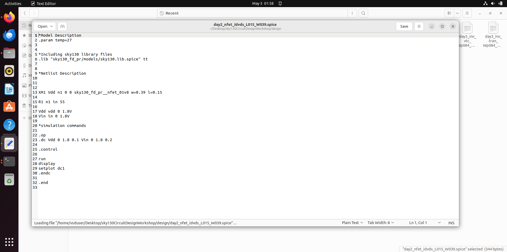

**Simulation Output:**

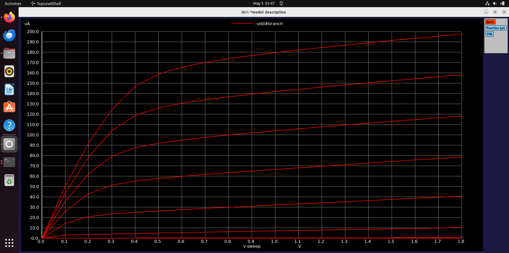

**Observations:**
- Curves flatten (saturate) much earlier than Day 1 long channel device
- Short channel carries **less current** than expected from long channel equations
- This is the effect of **velocity saturation** at L = 0.15µm

---

### Simulation 2 — Id vs Vgs (Short Channel NMOS, L=0.15µm, W=0.39µm)

**SPICE Netlist:**

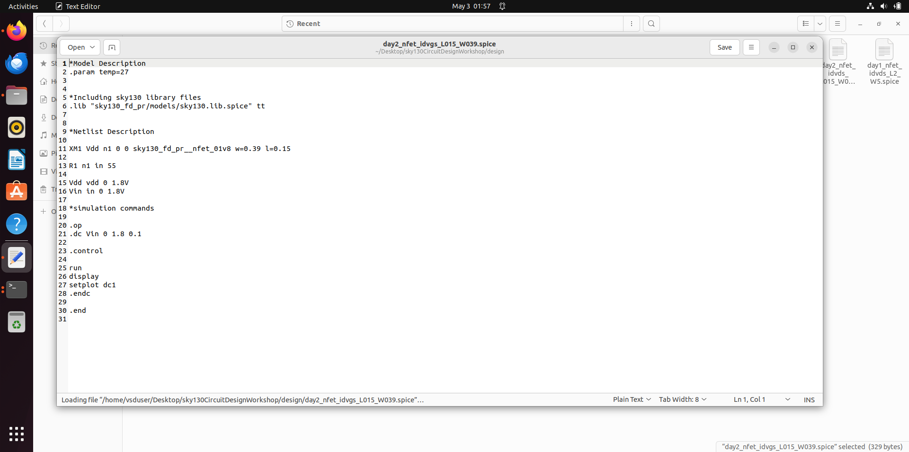

**Simulation Output:**

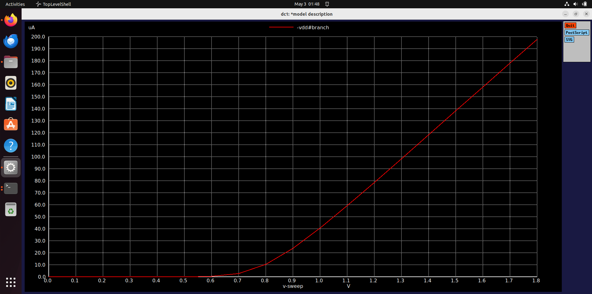

**Observations:**
- Id vs Vgs is **nearly linear** — not quadratic as in long channel devices
- This confirms **velocity saturation** is dominant in this short channel device
- Current starts rising at Vgs ≈ **0.76V** (threshold voltage Vt)
- Peak current at Vgs = 1.8V ≈ **198µA**

---

### CMOS Inverter – Introduction

The CMOS inverter consists of one PMOS (connected to VDD) and one NMOS (connected to GND) with gates and drains tied together.

| Input (Vin) | PMOS state | NMOS state | Output (Vout) |
|-------------|------------|------------|---------------|
| 0V (LOW) | ON | OFF | VDD (HIGH) |
| VDD (HIGH) | OFF | ON | 0V (LOW) |

One transistor is always OFF in steady state → **virtually zero static power consumption.**

---

## Day 3 – CMOS Switching Threshold and Dynamic Simulations

### Switching Threshold (Vm)

The **switching threshold Vm** is the input voltage at which Vout = Vin. At this point:
- Both NMOS and PMOS are simultaneously in **saturation**
- Maximum current flows — most power-hungry operating point

```
Vm = (Vt_n + (√(kp/kn)) × (VDD + Vt_p)) / (1 + √(kp/kn))
```

- Increasing PMOS W/L → Vm shifts **right**
- Increasing NMOS W/L → Vm shifts **left**
- For Sky130: PMOS needs ~**2.77× wider** than NMOS for Vm ≈ VDD/2

**Simulated Vm (Wp=0.84µm, Wn=0.36µm):** ≈ **0.876V**

---

### Simulation 1 — VTC and Switching Threshold

**SPICE Netlist:**

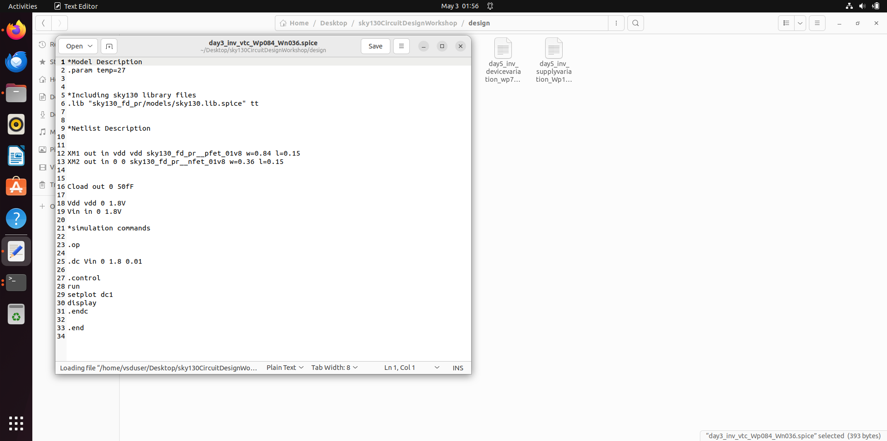

**Simulation Output:**

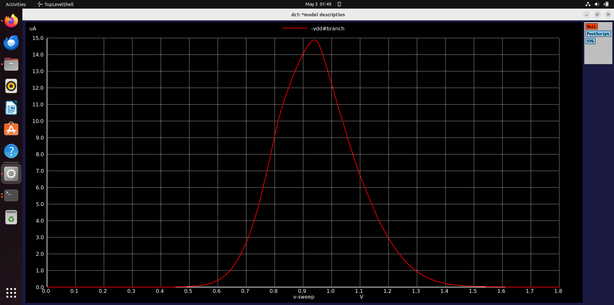

**Observations:**
- Bell shaped current curve — peak at switching threshold Vm ≈ **0.876V**
- Peak current ≈ **14.8µA** — maximum power dissipation point
- Curve is symmetric → confirms balanced W/L ratio (Wp/Wn ≈ 2.77)
- Left of peak → PMOS dominating | Right of peak → NMOS dominating

---

### Transient Analysis – Rise and Fall Delay

Delay is measured at **50% of VDD (≈ 0.9V)**:
- **Rise Delay:** Input falls → output rises, both at 0.9V
- **Fall Delay:** Input rises → output falls, both at 0.9V

**From simulation (Wp=0.84µm, Wn=0.36µm):**
- Rise Delay ≈ **0.333 ns**
- Fall Delay ≈ **0.285 ns**

| PMOS Width (W_p) | Vm | Rise Delay | Fall Delay |
|------------------|-----|------------|------------|
| Small (W_p = W_n) | Low | Large | Small |
| Balanced (W_p ≈ 2.77×W_n) | ≈ VDD/2 | ≈ Fall | ≈ Rise |
| Large (W_p >> W_n) | High | Small | Large |

---

### Simulation 2 — Transient Analysis

**SPICE Netlist:**

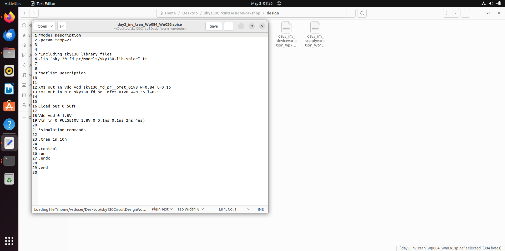

**Simulation Output:**

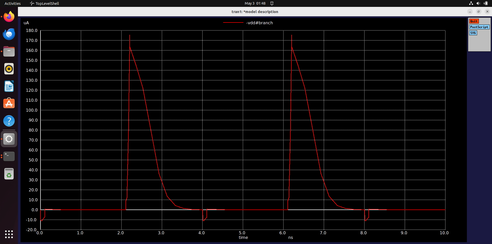

**Observations:**
- X-axis → time in nanoseconds, Y-axis → current in µA
- Repeating pulse pattern confirms correct switching behavior
- Sharp positive peaks → NMOS current when input switches HIGH
- Small negative dips → PMOS current when input switches LOW
- Peak current ≈ **175µA** during switching transitions

---

## Day 4 – CMOS Noise Margin Robustness

### What is Noise Margin?

**Noise Margin** quantifies how much noise a logic gate can tolerate at its input while still producing a correct output. Think of it as a safety buffer.

### Key VTC Parameters

| Parameter | Definition |
|-----------|-----------|
| **VOH** | Max output voltage when HIGH (ideally VDD) |
| **VOL** | Min output voltage when LOW (ideally 0V) |
| **VIH** | Min input recognized as logic HIGH (slope = -1 point) |
| **VIL** | Max input recognized as logic LOW (slope = -1 point) |

### Noise Margin Equations

```
NMH (Noise Margin High) = VOH - VIH
NML (Noise Margin Low)  = VIL - VOL
```

**From Sky130 simulation (Wp=1µm, Wn=0.36µm, VDD=1.8V):**

| Parameter | Value |
|-----------|-------|
| VOH | 1.70952 V |
| VOL | 0.09523 V |
| VIH | 0.98778 V |
| VIL | 0.77330 V |
| **NMH** | **0.72 V** |
| **NML** | **0.68 V** |

Nearly **40% of VDD** noise margin on each side — very robust!

---

### Simulation — Noise Margin

**SPICE Netlist:**

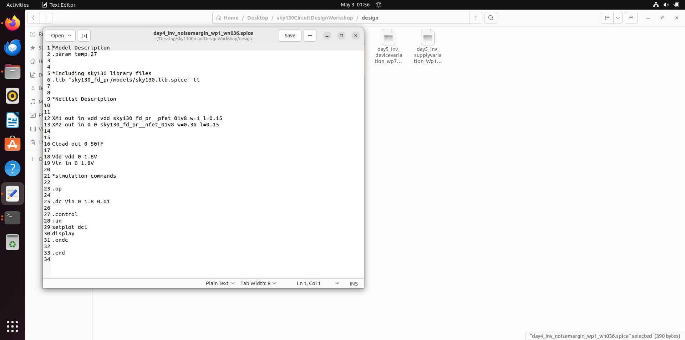

**Simulation Output:**


**Observations:**
- Clear HIGH region (Vout ≈ VDD) and LOW region (Vout ≈ 0V)
- Steep transition between VIL and VIH — high gain region
- VOH ≈ 1.71V, VOL ≈ 0.095V — excellent output levels
- NMH ≈ 0.72V, NML ≈ 0.68V — symmetric and robust noise immunity
- VTC has two flat regions (digital, noise-immune) and one steep region (analog, high gain)

---

## Day 5 – Power Supply and Device Variation Robustness

### Power Supply Variation

As technology scales, VDD must reduce to limit power consumption. Key trade-offs:

| VDD | Gain | Noise Margin | Speed | Power |
|-----|------|--------------|-------|-------|
| 1.8V | High | Large | Fast | High |
| 1.4V | Medium | Medium | Medium | Medium |
| 1.0V | Lower | Smaller | Slower | Low |
| 0.8V | Low | Small | Slow | Very Low |

**Advantage:** Dynamic power P = C × VDD² × f reduces **quadratically** with VDD.
**Disadvantage:** Noise margins shrink, delays increase, gain reduces at lower VDD.

---

### Simulation 1 — Supply Voltage Variation

**SPICE Netlist:**

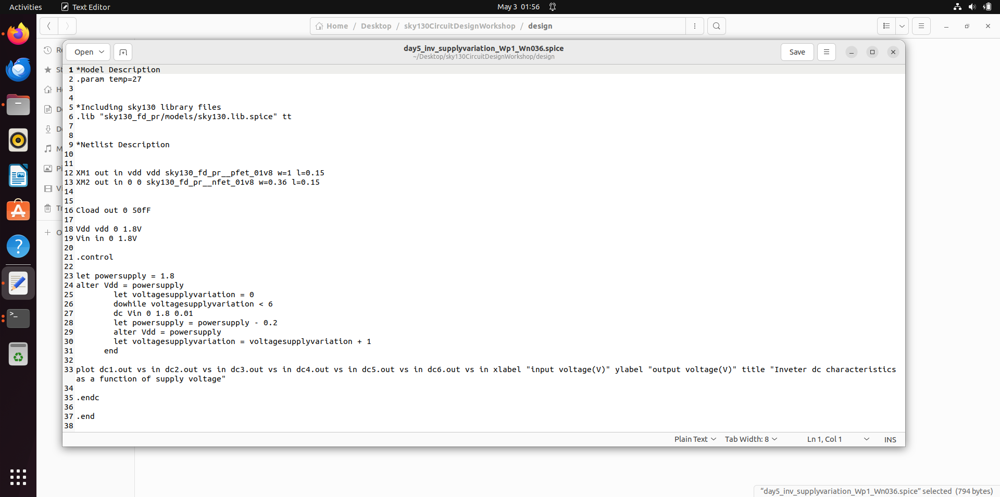

**Simulation Output:**

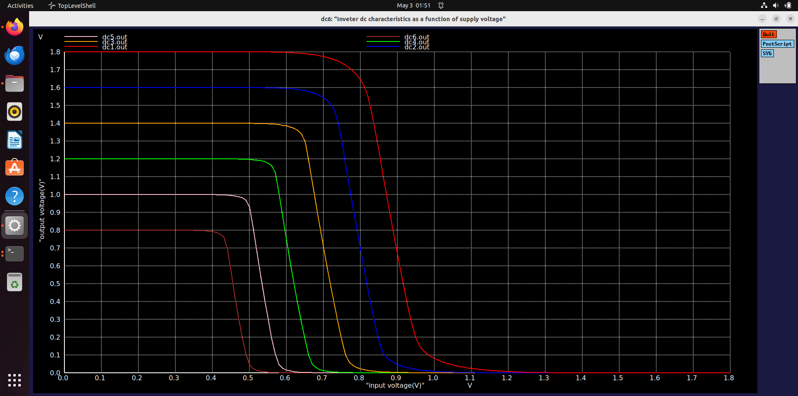

**Observations:**
- Each colored curve = different VDD (0.8V to 1.8V)
- As VDD decreases → output swing reduces proportionally
- VTC transition becomes less sharp at lower VDD
- Even at 0.8V inverter still functions correctly
- Demonstrates excellent **CMOS robustness to supply variation**

---

### Device Variation

Fabrication processes are never perfectly uniform. Etching variation causes W and L to differ across the wafer, affecting drive current, switching threshold, and delays.

**Process corners used in timing analysis:**

| Corner | NMOS | PMOS | Effect |
|--------|------|------|--------|
| **TT** | Typical | Typical | Nominal operation |
| **FF** | Fast | Fast | Setup violations risk |
| **SS** | Slow | Slow | Hold violations risk |
| **FS** | Fast | Slow | Asymmetric behavior |
| **SF** | Slow | Fast | Asymmetric behavior |

---

### Simulation 2 — Device Variation

**SPICE Netlist:**

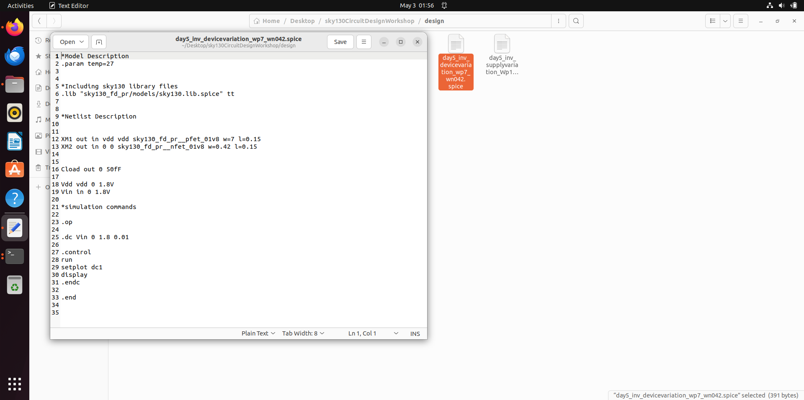

**Simulation Output:**

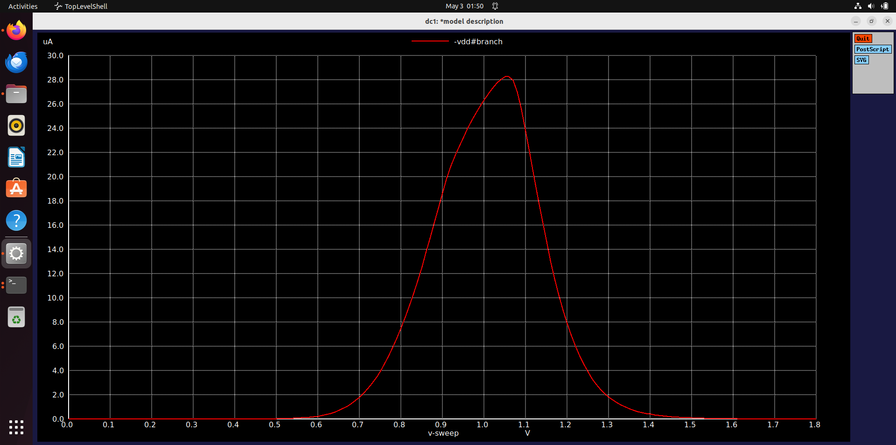

**Observations:**
- VTC curves for different W/L combinations (strong/weak NMOS and PMOS)
- Strong PMOS + Weak NMOS → Vm shifts **right**
- Strong NMOS + Weak PMOS → Vm shifts **left**
- Despite W/L variations, noise margins remain large
- CMOS logic remains **functionally correct** across all process corners

---

## Key Takeaways

### 1. MOSFET Fundamentals
- Threshold voltage (Vt) is process-dependent and affected by body bias
- Three operating regions: cut-off, linear, and saturation
- Channel length modulation causes slight Id increase with Vds in saturation

### 2. Short Channel Effects
- Velocity saturation makes short channel Id vs Vgs more linear than quadratic
- Short channel devices carry less current than expected from long channel equations

### 3. CMOS Inverter
- Complementary NMOS/PMOS gives extremely low static power
- VTC reveals complete input-output behavior
- W/L ratio controls switching threshold Vm

### 4. Dynamic Behavior
- Rise and fall delays depend on load capacitance and transistor strength
- PMOS needs ~2.77× wider than NMOS for symmetric delays in Sky130

### 5. Noise Margin
- NMH ≈ 0.72V and NML ≈ 0.68V for optimized Sky130 inverter at VDD = 1.8V
- CMOS noise margins are robust to transistor sizing variations

### 6. Robustness
- CMOS inverter maintains correct logic function across wide VDD range
- Process corners (FF, SS, FS, SF, TT) bound worst-case behavior
- Despite fabrication variations, CMOS logic remains reliable

---

## Acknowledgements

- Course Instructor: **Kunal Ghosh**, VSD (VLSI System Design)
- Sky130 PDK: **SkyWater Technology Foundry** and **Google**
- Simulation Tool: **ngspice** open-source community

---

## Author

**Bhuvanachandra Kusuma**
Workshop Participant — CMOS Circuit Design and SPICE Simulations using Sky130
